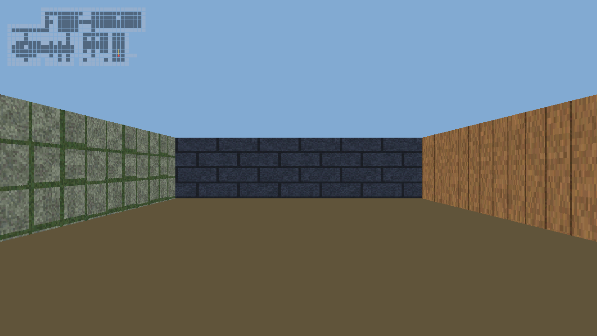

# cub3D — a Wolfenstein-style raycasting engine in C

A real-time software renderer in the spirit of *Wolfenstein 3D* (1992): the world
is a 2D grid, but a raycasting pipeline turns it into a textured first-person view —
one ray per screen column, no GPU, no game engine, no image library.



Built as part of the École 42 curriculum (`cub3D` project) and extended into a
cross-platform engine that runs natively on **macOS (SDL2)** and **Linux (MinilibX/X11)**
from a single platform-independent core.

## Features

- **Raycasting renderer** — classic DDA (Digital Differential Analyzer) grid
  traversal with perpendicular-distance projection, so there is no fisheye
  distortion. One ray per screen column at 1280x720.
- **Textured walls** — each wall face (north / south / east / west) gets its own
  texture, sampled per-pixel; y-side walls are shaded darker for depth.
- **Scene description files** (`.cub`) — texture paths, floor/ceiling colors and
  the map grid are parsed and strictly validated (see *Map format*).
- **Map validation by flood fill** — the walkable area is flooded from the player
  spawn; if it ever reaches the map edge or a void cell, the map is rejected.
- **Smooth movement** — WASD + arrow-key rotation with delta-time based speed,
  axis-separated collision so the player slides along walls instead of sticking.
- **Minimap overlay** — alpha-blended top-down view with player position and
  facing direction (Bresenham line), toggleable at runtime.
- **Custom XPM texture loader** — a minimal XPM3 reader keeps both backends free
  of any image-library dependency.
- **Headless rendering mode** — `--screenshot` renders a frame straight to a PPM
  file without opening a window, which powers the automated test suite (and the
  screenshot above).
- **Zero leaks** — verified with `leaks --atExit` on every valid and invalid
  scene in the repository; compiles clean with `-Wall -Wextra -Werror`.

## Architecture

```
src/
├── main.c               CLI entry point (windowed / headless)
├── parser/              .cub scene parsing and validation
│   ├── read_lines.c     whole-file reader
│   ├── parse_scene.c    config/map block splitting
│   ├── parse_config.c   texture paths, RGB colors
│   ├── parse_map.c      grid building, player extraction
│   └── validate_map.c   flood-fill closure check
├── engine/              simulation (platform-independent)
│   ├── game.c           init / frame update / teardown
│   └── player.c         movement, rotation, collision
├── render/              software rendering (platform-independent)
│   ├── raycast.c        DDA raycaster + wall texturing
│   ├── framebuffer.c    ARGB framebuffer, PPM export
│   ├── texture.c        XPM3 loader
│   └── minimap.c        minimap overlay
└── platform/            one thin backend, chosen at build time
    ├── platform_sdl2.c  macOS (or any SDL2 platform)
    └── platform_mlx.c   Linux (MinilibX / X11)
```

The core never touches a windowing API: it renders into a plain `uint32_t`
framebuffer and reads an abstract key-state struct. Each backend (~120 lines)
owns the window and main loop, translates native key events, and presents the
framebuffer. Porting to a new platform means implementing one function:
`platform_run()`.

## Building

### macOS

```sh
brew install sdl2
make
```

### Linux

```sh
sudo apt install build-essential libx11-dev libxext-dev   # Debian/Ubuntu
make        # clones and builds MinilibX automatically
```

The Makefile picks the backend from `uname`; override it with
`make BACKEND=sdl2` or `make BACKEND=mlx`.

## Running

```sh
./cub3D maps/demo.cub
```

| Key            | Action                  |
| -------------- | ----------------------- |
| `W` / `S`      | move forward / backward |
| `A` / `D`      | strafe left / right     |
| `←` / `→`      | turn left / right       |
| `M`            | toggle minimap          |
| `ESC`          | quit                    |

Extra flags:

```sh
./cub3D maps/demo.cub --screenshot out.ppm   # render one frame headlessly, no window
./cub3D maps/demo.cub --frames 120           # exit after N frames (smoke testing)
```

## Map format

A `.cub` scene file lists six required elements followed by the map grid:

```
NO ./assets/textures/north.xpm
SO ./assets/textures/south.xpm
WE ./assets/textures/west.xpm
EA ./assets/textures/east.xpm

F 96,84,58        # floor color (R,G,B)
C 130,170,210     # ceiling color (R,G,B)

111111
1000N1            # 1 wall, 0 floor, NSEW player spawn + facing
101001
100001
111111
```

The parser rejects duplicate or missing elements, out-of-range colors, invalid
map characters, zero or multiple spawns, blank lines inside the map, and any
map whose walkable area is not fully enclosed by walls. Errors are reported as
`Error` followed by a human-readable reason, and every error path frees all
allocations.

## Testing

```sh
make test
```

The suite (`tests/run_tests.sh`) covers:

- **9 rejected scenes** — every validation rule has a matching broken map in
  `maps/invalid/` and must fail with the `Error` banner.
- **Headless rendering** — valid maps must render and produce a well-formed
  P6 PPM image.
- **Main-loop smoke test** — 30 frames on SDL's dummy video driver, so the
  windowed code path runs even on a headless CI machine.

## Project notes

- Wall textures are procedurally generated 64x64 XPM files
  (running-bond brick, stone blocks, wood planks).
- `libft/` is the 42-curriculum C utility library this project builds on.
- The renderer is intentionally single-threaded software rasterization — the
  point of the project is to own every pixel from ray to framebuffer.
